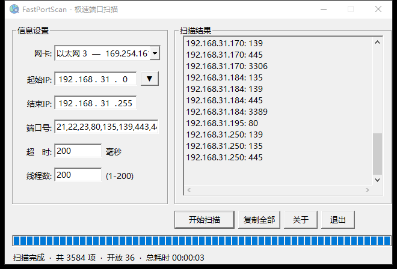
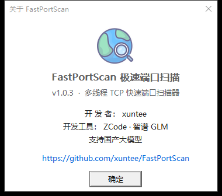

# FastPortScan — 极速端口扫描

FastPortScan（极速端口扫描）是一个用 C++/Win32 编写的多线程快速 TCP 端口扫描器。静态链接，单文件即可运行，无运行库依赖。


## 截图





## 功能

- **TCP 连接扫描**：非阻塞 connect + select 毫秒级超时 + 多线程（1-200，默认 10，低于正常优先级）
- **实时进度**：进度条 + 状态栏（进度 / 已完成 / 总数 / 开放数 / 已用时间 / 预计剩余 时:分:秒），完成后显示总耗时
- **网卡一键填段**：下拉选择本机适配器，按子网前缀自动填入起止 IP（如 /24 → x.x.x.0 ~ x.x.x.255）
- **IP 段历史**：▼ 下拉最近使用的扫描范围；IP 段 / 端口 / 超时 / 线程设置持久化到 `FastPortScan.ini`
- **结果交互**：结果行**单击复制**该行，**双击用默认浏览器打开** `http://ip:port`（443 走 https）；另有"复制全部"按钮
- 端口格式：逗号分隔，支持单端口与区间（`80,139,440-445`）；超时 1-15000ms，线程 1-200

## 使用

运行 `FastPortScan.exe`（x64 静态链接）。程序图标与版本信息已作为资源嵌入 exe，无需附带任何外部文件。

## 编译

```
bash build.sh
```

核心命令（CI 用 MSVC 编译，误报率更低；本地无 VS 时可用 pip 包 ziglang）：

```
python -m ziglang rc -c 65001 assets/app.rc app.res
python -m ziglang c++ -target x86_64-windows-gnu -O2 -municode -static \
    -Wl,--subsystem,windows \
    src/main.cpp src/common.cpp src/scan.cpp src/config.cpp src/about.cpp \
    app.res -o FastPortScan.exe \
    -lws2_32 -lcomctl32 -liphlpapi -lgdi32 -lshell32
```

MSVC（与 CI 相同）：`rc /c 65001 /fo app.res assets\app.rc` 后
`cl /O2 /EHsc /MT /utf-8 /DUNICODE /D_UNICODE src\*.cpp app.res /link /SUBSYSTEM:WINDOWS /ENTRY:wWinMainCRTStartup /MANIFEST:EMBED user32.lib gdi32.lib shell32.lib ws2_32.lib comctl32.lib iphlpapi.lib advapi32.lib`

## CI

推送 tag（`v1.0.0` 等）自动编译并创建 GitHub Release 附上 exe：见 `.github/workflows/release.yml`。

## 目录结构

```
├── src/                      源码（main / common / scan / config / about）
├── assets/app.rc             资源脚本（图标 + 版本信息，编译时嵌入 exe）
├── assets/logo.png|.ico      程序图标素材
├── build.sh                  编译脚本
└── .github/workflows/        tag 自动构建 Release
```

## 扫描内核（实测 /24 网段 3072 项约 13 秒）

```
工作线程 × N（低于正常优先级）：
    临界区内领取下一个 IP:端口（顺序遍历 [起始IP..结束IP] × 端口区间）
    socket(AF_INET, SOCK_STREAM, 0) + ioctlsocket(FIONBIO) 非阻塞
    connect() == 0 → 开放；WSAEWOULDBLOCK → select() 写集合按毫秒超时判定
    closesocket；开放则结果框追加 "%d.%d.%d.%d: %d"
    InterlockedIncrement 计数 → 进度条 / ETA
```
